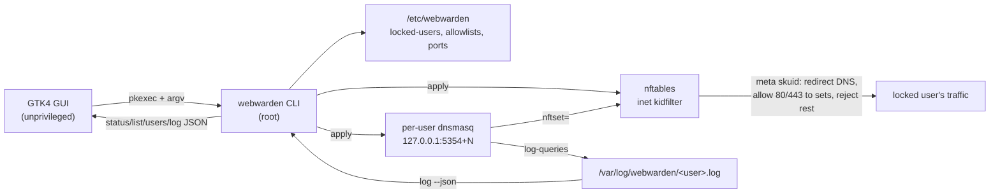

# System Architecture

## Data / enforcement flow

## Components
- **Backend CLI (`webwarden`, Python 3, `/usr/local/sbin/webwarden`)** — the only
  privileged component. Manages per-user allowlists, generates per-user dnsmasq
  configs and the `inet kidfilter` nftables ruleset, drives systemd, parses logs,
  and exposes a stable JSON contract.
- **Per-user dnsmasq instances** — one per locked user on loopback port `5354 + index`;
  resolve only allowlisted domains, answer everything else `0.0.0.0`/`::`, auto-populate
  per-user nftables IP sets, and log queries.
- **nftables `inet kidfilter`** — per-UID (`meta skuid`) default-deny egress; redirects each
  locked UID's DNS to its dnsmasq instance; permits tcp 80/443 only to that user's allow sets.
- **systemd** — `webwarden-dns@<user>.service` (templated) + `webwarden-nft.service` (oneshot)
  restore state at boot.
- **GTK4 GUI (`webwarden-admin`, unprivileged)** — drives the CLI via `pkexec` (Polkit);
  reads JSON, never writes `/etc/webwarden` directly.
- **Log retention** — `settings.log_retention_days` (in `/etc/webwarden/settings.json`) bounds
  blocked-log growth. Old entries are pruned at the end of every `apply`, by a daily
  `webwarden-logprune.timer`, and on demand; `webwarden log --clear` truncates all user logs.
  Pruning rewrites each file in place (preserving inode/owner, like logrotate `copytruncate`).
- **Allowlist discovery** — a modern site spans many registrable domains + dynamic subdomains;
  allowlisting one leaves it broken. Because dnsmasq `server=/d/`+`nftset=/d/` already suffix-match,
  approving the *registrable* domain (`googlevideo.com`) covers all its subdomains. `log --summary
  --group` (`domain_groups.registrable`, a heuristic eTLD+1) collapses blocked subdomains to the
  registrable domain and flags shared/multi-tenant CDNs (`broad`). The GUI **Blocked-Log** view adds
  a per-user filter and multi-select **batch approve** (one `allow <user> <d…>` per user), so the
  admin builds the allowlist empirically from what a visit blocked — human-in-the-loop, no auto-add.

## Trust boundary
Domain input is normalized + validated (`validation.py`) before being passed to the CLI as
argv arrays — never shell-interpolated. Mutations require admin auth via the shipped Polkit policy.

## Stable CLI contract
See `plans/260624-2214-webwarden-backend-gui-build/plan.md` (the GUI's API). Additive commands:
`webwarden settings [--json | --set-retention-days N]` and `webwarden log [--prune [--days N] | --clear]`.
`webwarden log --summary --group` is additive (read-only): grouped rows key on the registrable domain,
sum member counts, and add a `broad` boolean. `log --summary` without `--group` is unchanged.
